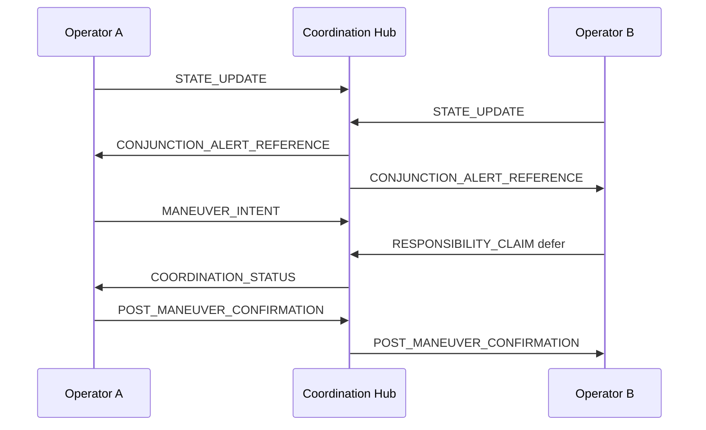

# Architecture

SAIL is organized around the same three autonomy layers used in the accompanying research paper: spacecraft autonomy, neighborhood autonomy, and infrastructure autonomy.

## Layer 1: Spacecraft Autonomy

The spacecraft layer describes a vehicle's local status and authority to act.

SAIL fields at this layer include:

- Object identity
- Current autonomy mode
- Propulsion availability
- Maneuverability state
- Degraded-state flags
- Decision mode for safety actions

The purpose is not to expose flight code. The purpose is to make safety-relevant state legible to authorized coordination partners.

## Layer 2: Neighborhood Autonomy

The neighborhood layer is where adjacent satellites, shell neighbors, and cross-operator conjunction participants coordinate.

SAIL messages at this layer include:

- `STATE_UPDATE`
- `MANEUVER_INTENT`
- `RESPONSIBILITY_CLAIM`
- `POST_MANEUVER_CONFIRMATION`

This is the core of the standard. It lets one operator say, in machine-readable form, "I see the event, I can move, I intend to move in this window, and I claim responsibility for mitigation."

## Layer 3: Infrastructure Autonomy

The infrastructure layer concerns fleet-level behavior, service continuity, auditability, and governance visibility.

SAIL records at this layer include:

- Audit metadata
- Software version identifiers
- Communication failure indicators
- Policy basis for autonomous decisions
- Scenario and stress-test outputs

This layer turns autonomous coordination into evidence that can be reviewed after an incident or during licensing.

## Message Flow

## Trust Boundary

SAIL can run through a civil coordination hub, operator-to-operator channel, or test simulator. In all cases, the standard assumes:

- Authentication happens below or beside the message layer.
- Operators remain responsible for their own spacecraft.
- Messages are signed or otherwise attributable in operational deployments.
- Expired messages must not be used for autonomous safety decisions.
